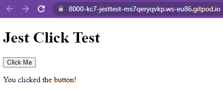
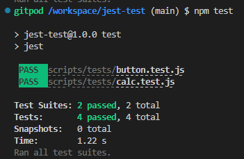

# Jest Tests

This is my first mini project to create tests using Jest. 

## How to View the Site

To run a this site in Gitpod, in the terminal, type:

`python3 -m http.server`

- A blue button should appear to click: _Make Public_,

- Another blue button should appear to click: _Open Browser_.

## How to Run the Tests

To run the tests in Gitpod, in the terminal, type:

`npm test`

## How was Jest Installed? 

How to install Jest: 

1. Type `npm init` into the terminal. 
2. Use default settings for all except **test command**, type `jest` here.
3. When the package.json file has been installed, type `npm install --save-dev jest`

Note, a previous version of Jest was installed in this project, I did this by entering the following for step 3. `npm install --save-dev jest@26.6.3`

## Credits

I learned this information through the Code Institute. 
